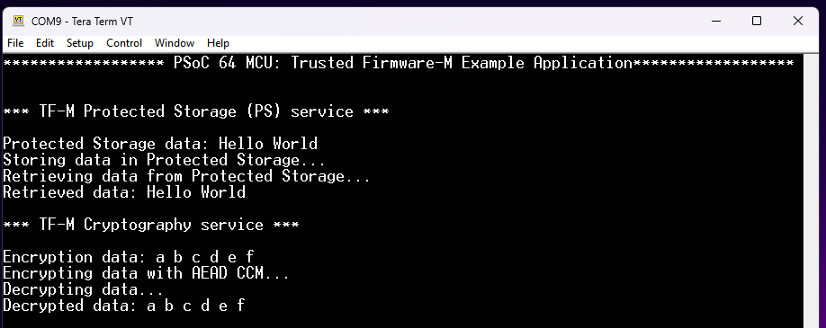
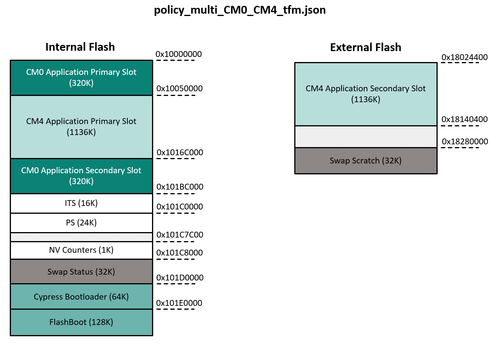

# PSoC&trade; 64: Trusted Firmware-M (TF-M) services with PSA APIs

This code example demonstrates how to use Trusted Firmware-M (TF-M) services on PSoC&trade; 64 with PSA APIs. TF-M executes on Cortex&reg; M0+ CPU (Secure Processing Environment - SPE) and the user application executes on Cortex&reg; M4 CPU (Non-Secure Processing Environment - NSPE).

Trusted Firmware-M (TF-M) implements the SPE for Armv8-M, Armv8.1-M architectures (e.g., the Cortex&reg;-M33, Cortex&reg;-M23, Cortex&reg;-M55, Cortex&reg;-M85 processors) and dual-core platforms. It is the platform security architecture reference implementation aligning with PSA-certified guidelines, enabling chips,real time operating systems and devices to become PSA certified. For more details, see the [Trusted Firmware-M Documentation](https://tf-m-user-guide.trustedfirmware.org/).

[View this README on GitHub.](https://github.com/Infineon/mtb-example-psoc6-tfm-freertos)

[Provide feedback on this code example.](https://cypress.co1.qualtrics.com/jfe/form/SV_1NTns53sK2yiljn?Q_EED=eyJVbmlxdWUgRG9jIElkIjoiQ0UyMzkwNDciLCJTcGVjIE51bWJlciI6IjAwMi0zOTA0NyIsIkRvYyBUaXRsZSI6IlBTb0MmdHJhZGU7IDY0OiBUcnVzdGVkIEZpcm13YXJlLU0gKFRGLU0pIHNlcnZpY2VzIHdpdGggUFNBIEFQSXMiLCJyaWQiOiJyYW1hbmlqYWxkZWUiLCJEb2MgdmVyc2lvbiI6IjEuMC4wIiwiRG9jIExhbmd1YWdlIjoiRW5nbGlzaCIsIkRvYyBEaXZpc2lvbiI6Ik1DRCIsIkRvYyBCVSI6IklDVyIsIkRvYyBGYW1pbHkiOiJQU09DIn0=)

## Requirements

- [ModusToolbox&trade;](https://www.infineon.com/modustoolbox) v3.1 or later (tested with v3.1)
- Board support package (BSP) minimum required version: 4.0.0
- Programming language: C
- Other tools: Python 3.7.0 or later
- [CySecureTools 4.1.0](https://pypi.org/project/cysecuretools/)
- Associated parts: All [PSoC&trade; 64](https://www.infineon.com/cms/en/product/microcontroller/32-bit-psoc-arm-cortex-microcontroller/psoc-6-32-bit-arm-cortex-m4-mcu/psoc-64/) parts

## Supported toolchains (make variable 'TOOLCHAIN')

- GNU Arm&reg; Embedded Compiler v11.3.1 (`GCC_ARM`) – Default value of `TOOLCHAIN`

## Supported kits (make variable 'TARGET')

- [PSoC&trade; 64 "Secure Boot" Wi-Fi Bluetooth&reg; Pioneer Kit](https://www.infineon.com/CY8CKIT-064B0S2-4343W) (`CY8CKIT-064B0S2-4343W`) – Default value of `TARGET`

> **Note:** See the [PSoC&trade; 64 "Secure Boot" SDK user guide](https://www.infineon.com/dgdlac/Infineon-PSoC_64_Secure_MCU_Secure_Boot_SDK_User_Guide-Software-v07_00-EN.pdf?fileId=8ac78c8c7d0d8da4017d0f8c361a7666) before working with a target enabled with "Secure Boot".

## Hardware setup

This example is used with PSoC&trade; 64 "Secure" MCU kits. To program and run the example on a PSoC&trade; 64 "Secure" MCU platform, the device must be provisioned with keys and policies, and then programmed with the signed firmware to boot up correctly.

## Software setup

Install a terminal emulator if you don't have one. Instructions in this document use [Tera Term](https://teratermproject.github.io/index-en.html).

This example requires Python 3.7.0 and the “CySecureTools” package to be installed.

### Install Python

<details open><summary><b>On Windows</b></summary>

For Windows, the installation of ModusToolbox&trade; 3.1 or later provides all the tools required to build, program, and provision devices. This includes the correct version of Python as well. Windows users can skip this procedure.
</details>

<details><summary><b>On Linux</b></summary>

Most distributions of Linux usually have Python 2 and Python 3 installed.

1. Verify that Python points to Python 3. Run the following command:

   ```
   python --version
   ```

2. (Optional) If Python is not installed on your machine, install it using the following command:

   ```
   sudo apt install python3.7
   ```

3. Install pip. Run the following command:

   ```
   sudo apt install python3-pip
   ```

4. Make sure that pip is using Python 3.7 using the following command:

   ```
   pip --version
   ```
</details>

<details><summary><b>On macOS</b></summary>

1. Download and install the latest Python 3 release from https://www.python.org/downloads/mac-osx/.

2. Install pip:

   ```
   python3 -m pip install --upgrade pip
   ```
</details>

### Install CySecureTools

1. Run the following command:

   ```
   pip install cysecuretools==4.1.0
   ```

## Using the code example

### Create the project

The ModusToolbox&trade; tools package provides the Project Creator as both a GUI tool and a command line tool.

<details><summary><b>Use Project Creator GUI</b></summary>

1. Open the Project Creator GUI tool.

   There are several ways to do this, including launching it from the dashboard or from inside the Eclipse IDE. For more details, see the [Project Creator user guide](https://www.infineon.com/ModusToolboxProjectCreator) (locally available at *{ModusToolbox&trade; install directory}/tools_{version}/project-creator/docs/project-creator.pdf*).

2. On the **Choose Board Support Package (BSP)** page, select a kit supported by this code example. See [Supported kits](#supported-kits-make-variable-target).

   > **Note:** To use this code example for a kit not listed here, you may need to update the source files. If the kit does not have the required resources, the application may not work.

3. On the **Select Application** page:

   a. Select the **Applications(s) Root Path** and the **Target IDE**.

   > **Note:** Depending on how you open the Project Creator tool, these fields may be pre-selected for you.

   b.	Select this code example from the list by enabling its check box.

   > **Note:** You can narrow the list of displayed examples by typing in the filter box.

   c. (Optional) Change the suggested **New Application Name** and **New BSP Name**.

   d. Click **Create** to complete the application creation process.

</details>

<details><summary><b>Use Project Creator CLI</b></summary>

The 'project-creator-cli' tool can be used to create applications from a CLI terminal or from within batch files or shell scripts. This tool is available in the *{ModusToolbox&trade; install directory}/tools_{version}/project-creator/* directory.

Use a CLI terminal to invoke the 'project-creator-cli' tool. On Windows, use the command-line 'modus-shell' program provided in the ModusToolbox&trade; installation instead of a standard Windows command-line application. This shell provides access to all ModusToolbox&trade; tools. You can access it by typing "modus-shell" in the search box in the Windows menu. In Linux and macOS, you can use any terminal application.

The following example clones the "[mtb-example-psoc6-tfm-freertos
](https://github.com/Infineon/mtb-example-psoc6-tfm-freertos
)" application with the desired name "TfmServices" configured for the *CY8CKIT-064B0S2-4343W* BSP into the specified working directory, *C:/mtb_projects*:

   ```
   project-creator-cli --board-id CY8CKIT-064B0S2-4343W --app-id mtb-example-psoc6-tfm-freertos --user-app-name TfmServices --target-dir "C:/mtb_projects"
   ```

The 'project-creator-cli' tool has the following arguments:

Argument | Description | Required/optional
---------|-------------|-----------
`--board-id` | Defined in the <id> field of the [BSP](https://github.com/Infineon?q=bsp-manifest&type=&language=&sort=) manifest | Required
`--app-id`   | Defined in the <id> field of the [CE](https://github.com/Infineon?q=ce-manifest&type=&language=&sort=) manifest | Required
`--target-dir`| Specify the directory in which the application is to be created if you prefer not to use the default current working directory | Optional
`--user-app-name`| Specify the name of the application if you prefer to have a name other than the example's default name | Optional

> **Note:** The project-creator-cli tool uses the `git clone` and `make getlibs` commands to fetch the repository and import the required libraries. For details, see the "Project creator tools" section of the [ModusToolbox&trade; tools package user guide](https://www.infineon.com/ModusToolboxUserGuide) (locally available at {ModusToolbox&trade; install directory}/docs_{version}/mtb_user_guide.pdf).

</details>


### Open the project

After the project has been created, you can open it in your preferred development environment.


<details><summary><b>Eclipse IDE</b></summary>

If you opened the Project Creator tool from the included Eclipse IDE, the project will open in Eclipse automatically.

For more details, see the [Eclipse IDE for ModusToolbox&trade; user guide](https://www.infineon.com/MTBEclipseIDEUserGuide) (locally available at *{ModusToolbox&trade; install directory}/docs_{version}/mt_ide_user_guide.pdf*).

</details>


<details><summary><b>Visual Studio (VS) Code</b></summary>

Launch VS Code manually, and then open the generated *{project-name}.code-workspace* file located in the project directory.

For more details, see the [Visual Studio Code for ModusToolbox&trade; user guide](https://www.infineon.com/MTBVSCodeUserGuide) (locally available at *{ModusToolbox&trade; install directory}/docs_{version}/mt_vscode_user_guide.pdf*).

</details>


<details><summary><b>Command line</b></summary>

If you prefer to use the CLI, open the appropriate terminal, and navigate to the project directory. On Windows, use the command-line 'modus-shell' program; on Linux and macOS, you can use any terminal application. From there, you can run various `make` commands.

For more details, see the [ModusToolbox&trade; tools package user guide](https://www.infineon.com/ModusToolboxUserGuide) (locally available at *{ModusToolbox&trade; install directory}/docs_{version}/mtb_user_guide.pdf*).

</details>

<br />

PSoC&trade; 64 requires provisioning of *keys* and *policies* into the hardware, the following sections describe the required steps. These secure keys and policies are used during the *secure boot flow*. For more information, see [PSoC&trade; 64 MCU "Secure Boot" SDK user guide](https://www.infineon.com/dgdl/Infineon-PSoC_64_Secure_MCU_Secure_Boot_SDK_User_Guide-Software-v07_00-EN.pdf?fileId=8ac78c8c7d0d8da4017d0f8c361a7666&da).

> **Notes:** 
   > - While creating/building the project if the following warnings are shown, ignore these warnings. The project will be created/built successfully. <br>
      ```
      warning: ignoring old recipe for target
      ```
      <br>
      ```
      warning: overriding recipe for target
      ```
   > - This code example uses the [trusted-firmware-m v1.3.110](https://github.com/Infineon/trusted-firmware-m/tree/release-v1.3.110) which is currently compatible with [mtb-pdl-cat1 v3.0.0](https://github.com/Infineon/mtb-pdl-cat1/tree/release-v3.0.0) only. Chaning the PDL version in the CE may cause build errors.

### Policy and keys

1. Open the CLI terminal and navigate to the *%WORKSPACE%/ApplicationName/* directory.

   On Windows, open the **modus-shell** app from the **Start** menu. On Linux and macOS, use any terminal application.
   
2. Execute the following command to finalize project initialization:

      ```
      cysecuretools -t <kit-name> init
      ```

      For example, the following command finalizes project initialization for the **CY8CKIT-064B0S2-4343W** kit:

      ```
      cysecuretools -t cy8ckit-064b0s2-4343w init
      ```
   
     > **Note:** After executing of the `init` command, all files that are required for application signing will be copied into *%WORKSPACE%/ApplicationName/* directory, including the default policy for the chosen `<kit-name>`.

3. Copy the **policy_multi_CM0_CM4_tfm.json** policy file from *%WORKSPACE%/ApplicationName/tfm_cm4_ns/imports/trusted-firmware-m/security/COMPONENT_CY8CKIT-064B0S2-4343W/policy* directory to *%WORKSPACE%/ApplicationName/policy* directory using the following command:

   ```
   cp ./tfm_cm4_ns/imports/trusted-firmware-m/security/COMPONENT_CY8CKIT-064B0S2-4343W/policy/policy_multi_CM0_CM4_tfm.json ./policy/
   ```

4. Add the keys that were used to provision the device into the project.

   Ensure that you are in the *%WORKSPACE%/ApplicationName/* directory and the policy is already added in the project.

   If you do not have the keys, generate default keys using the following command:

   ```
   cysecuretools -t <kit-name> -p <policy> create-keys
   ```

   For example, the following command generates the default keys for the **CY8CKIT-064B0S2-4343W** kit:

   ```
   cysecuretools -t cy8ckit-064b0s2-4343w -p policy/policy_multi_CM0_CM4_tfm.json create-keys
   ```
   
   > **Note:** If you generate the keys, you must use these keys to provision your device. Otherwise, the example does not work. See the "Generate New Keys" section in the [PSoC&trade; 64 "Secure Boot" SDK user guide](https://www.infineon.com/dgdlac/Infineon-PSoC_64_Secure_MCU_Secure_Boot_SDK_User_Guide-Software-v07_00-EN.pdf?fileId=8ac78c8c7d0d8da4017d0f8c361a7666).
   
   
5. The generated keys will be added into the *%WORKSPACE%/ApplicationName/keys* directory. 

   a. Delete the existing keys from the *%WORKSPACE%/ApplicationName/      tfm_cm4_ns/imports/trusted-firmware-m/security/COMPONENT_CY8CKIT-064B0S2-4343W/keys* directory using the following command:
      ```
      rm ./tfm_cm4_ns/imports/trusted-firmware-m/security/COMPONENT_CY8CKIT-064B0S2-4343W/keys/*
      ```

   b. Copy the generated keys from the *%WORKSPACE%/ApplicationName/keys* directory to *%WORKSPACE%/ApplicationName/tfm_cm4_ns/imports/trusted-firmware-m/security/COMPONENT_CY8CKIT-064B0S2-4343W/keys* directory using the following command. The BSP uses this default path to fetch the keys and sign the image.
      ```
      cp ./keys/TFM_S_KEY.* ./keys/TFM_NS_KEY.* ./tfm_cm4_ns/imports/trusted-firmware-m/security/COMPONENT_CY8CKIT-064B0S2-4343W/keys/
      ```

6. Provision the device. The “CySecureTools” application provisions the device based on the policy file. It performs the following steps:

   a. Reads the provided policy and forms the final provisioning packet, named "prov_cmt.jwt".

   b. Performs the entrance exam to verify that the device has not been altered.

   c. Provisions the device by sending the *prov_cmd.jwt* packet to the PSoC&trade; 64 "Secure" MCU.

   Before running this step, you can modify the default policy to match your end use case. For most development use cases, you do not need to modify it. See the [PSoC&trade; 64 "Secure Boot" SDK user guide](https://www.infineon.com/dgdlac/Infineon-PSoC_64_Secure_MCU_Secure_Boot_SDK_User_Guide-Software-v07_00-EN.pdf?fileId=8ac78c8c7d0d8da4017d0f8c361a7666) for more information.

  > **Note:** KitProg3 or the MiniProg4 must be in DAPLink mode. The kit supply voltage must be 2.5 V to perform this step. See the relevant kit user guide to learn how to change the supply voltage for your kit.

   ```
   cysecuretools -t <kit-name> -p <policy> provision-device
   ```

   For example, the following command generates the default keys for the **CY8CKIT-064B0S2-4343W** kit:

   ```
   cysecuretools -t cy8ckit-064b0s2-4343w -p policy/policy_multi_CM0_CM4_tfm.json provision-device
   ```

   To reprovision the device, use the following command:
   ```
   cysecuretools -t cy8ckit-064b0s2-4343w -p policy/policy_multi_CM0_CM4_tfm.json re-provision-device
   ```
   > **Note:**  If the device is already provisioned with the *policy_multi_CM0_CM4_tfm.json* policy, copy the keys generated during earlier provisioning process to the *%WORKSPACE%/ApplicationName/tfm_cm4_ns/imports/trusted-firmware-m/security/COMPONENT_CY8CKIT-064B0S2-4343W/keys* directory. Reprovisiong of device is not required.

## Operation

1. Connect the board to your PC using the provided USB cable through the KitProg3 USB connector.

2. Open a terminal program and select the KitProg3 COM port. Set the serial port parameters to 8N1 and 115200 baud.

3. Build and program the board using one of the following:

   <details><summary><b>Using Eclipse IDE</b></summary>

   a. Follow KBA238894: [PSoC&trade; 64: Debugging the individual cores (CM0+ and CM4)](https://community.infineon.com/t5/Knowledge-Base-Articles/PSoC-64-Debugging-the-individual-cores-CM0-and-CM4-KBA238894/ta-p/645274) **Section 1.1 and 1.1.1**. The KBA provides guidance on how to fix  launches and also enable the Program option in Quick Panel of ModusToolbox&trade;.

   b. Open *Run Configurations* in ModusToolbox&trade; and select **\<Application Name> Program Application (KitProg3_MiniProg4)**.

   c. In the **Main** tab, select the C/C++ application to *\<Application Name>/tfm_cm4_ns/build/APP_CY8CKIT-064B0S2-4343W/Debug/tfm_cm4_ns.elf* file.

   d. Navigate to **Startup** tab, in Load executable, select the Use file as *\<Application Name>/tfm_cm4_ns/build/APP_CY8CKIT-064B0S2-4343W/Debug/tfm_cm4_ns.hex* file.

   e. **Apply** the changes and click **Program** from *Run Configurations* OR In the **Quick Panel**, scroll down, and click **\<Application Name> Program Application (KitProg3_MiniProg4)**.
      
      > **Note:** The BSP Makefile's post-build command signs the both applications image built with ModusToolbox&trade;, so that the combined signed image generated on *tfm_cm4_ns* project can be programmed and run on PSoC&trade; 64 kits.

   </details>

   <details><summary><b>Using CLI</b></summary>

   1. **Build the application using CLI:**

      From the terminal, execute the `make build` command to build the application using the default toolchain to the default target. The default toolchain is specified in the application's Makefile but you can override this value manually:
      ```
      make build TOOLCHAIN=<toolchain>
      ```

      Example:
      ```
      make build TOOLCHAIN=GCC_ARM
      ```

   2. **Program the application using CLI:**
      
      Go to the ***tfm_cm4_ns*** directory and execute the `make program_proj` command to program the application using the default toolchain to the default target. The default toolchain is specified in the application's Makefile but you can override this value manually:
      ```
      make program_proj TOOLCHAIN=<toolchain>
      ```

      Example:
      ```
      make program_proj TOOLCHAIN=GCC_ARM
      ```
      > **Note:** The BSP Makefile's post-build command signs the both applications image built with ModusToolbox&trade;, so that the combined signed image generated on *tfm_cm4_ns* project can be programmed and run on PSoC&trade; 64 kits.
   </details>

4. After programming, the application starts automatically. Confirm that "***** PSoC 64 MCU: Trusted Firmware-M Example Application *****" is displayed on the UART terminal.


   **Figure 1. Terminal output on program startup**

   

   > **Note:** During the boot up phase of PSoC&trade; 64, you may see garbled data on the terminal emulator screen. The reason is that the KitProg3's (PSoC&trade; 5LP) debug UART RX input is not driven by PSoC&trade; 64 for a period of time. By default, the device firmware update (DFU) in PSoC&trade; 64 is in the debug mode and will print out DFU status information.  After this information is printed, the PSoC&trade; 64 TX GPIO is returned to its default Hi-Z state. Between the time the PSoC&trade; 64 TX GPIO pin is returned to Hi-Z and when the PSoC&trade; 64 application code reconfigures the GPIO pin, this signal may float and appear as UART data to the KitProg3 UART, which may be displayed as random characters on the terminal emulator. To eliminate this garbled data, a 10K pull-down resistor may be added between the PSoC&trade; 64 P5.1 GPIO and GND. This will pull the signal to GND while the PSoC&trade; 64 GPIO is Hi-Z and eliminate random noise causing invalid 1s and 0s to be detected by the KitProg3 UART.


## Debugging

To debug the example, follow *KBA238894: [PSoC&trade; 64: Debugging the individual cores (CM0+ and CM4)](https://community.infineon.com/t5/Knowledge-Base-Articles/PSoC-64-Debugging-the-individual-cores-CM0-and-CM4-KBA238894/ta-p/645274)*. The KBA provides guidance on how to fix launches and enable the debug on Cortex&reg; M0+ and Cortex&reg; M4 cores individually.

You can debug the example to step through the code.


<details><summary><b>In Eclipse IDE</b></summary>

Use the **\<Application Name> Debug (KitProg3_MiniProg4)** configuration in the **Quick Panel**. For details, see the "Program and debug" section in the [Eclipse IDE for ModusToolbox&trade; user guide](https://www.infineon.com/MTBEclipseIDEUserGuide).


> **Note:** **(Only while debugging)** On the CM4 CPU, some code in `main()` may execute before the debugger halts at the beginning of `main()`. This means that some code executes twice – once before the debugger stops execution, and again after the debugger resets the program counter to the beginning of `main()`. See [KBA231071](https://community.infineon.com/docs/DOC-21143) to learn about this and for the workaround.

</details>
<details><summary><b>In other IDEs</b></summary>

Follow the instructions in your preferred IDE.
</details>


See [PSoC&trade; 64 "Secure Boot" SDK user guide](https://www.infineon.com/dgdlac/Infineon-PSoC_64_Secure_MCU_Secure_Boot_SDK_User_Guide-Software-v07_00-EN.pdf?fileId=8ac78c8c7d0d8da4017d0f8c361a7666) for more information.


## Design and implementation

### Overview

This code example demonstrates Trusted Firmware-M (TF-M) services on PSoC&trade; 64 based on the [trusted-firmware-m](https://github.com/Infineon/trusted-firmware-m) library. This example has two applications:
<br>
   1. tfm_cm0_s: This application executes TF-M on Secure Processing Environment (SPE) by Cortex&reg; M0+ CPU.
   2. tfm_cm4_ns: This is a non-secure user application executing in NSPE by Cortex&reg; M4 CPU. 
<br>

This user application calls the TF-M non-secure interface library to request a TF-M secure service on CM0+. The TF-M non-secure interface library translates the secure service request into PSA Client call and sends to CM0+ over IPC. To understand the overall workflow of dual-core communication between NSPE and SPE in detail, *refer ["Overall workflow in dual-core communication"](https://tf-m-user-guide.trustedfirmware.org/design_docs/dual-cpu/communication_prototype_between_nspe_and_spe_in_dual_core_systems.html#overall-workflow-in-dual-core-communication) in the TF-M user guide*.

***To learn about the Trusted Firmware-M (TF-M) architecture, see the [FF-M compliant design with TF-M](https://tf-m-user-guide.trustedfirmware.org/introduction/readme.html#id2)***

[Trusted-firmware-m ModusToolbox&trade; library](https://github.com/Infineon/trusted-firmware-m) provides secure services like *Crypto, Internal Trusted Storage (ITS), Protected Storage (PS), and Attestation*. See [TF-M Secure Services](https://tf-m-user-guide.trustedfirmware.org/design_docs/services/index.html#secure-services) for more information.

### Memory layout

The development kit has a 2 MB internal flash and a 512 MB external flash, which is partitioned into the regions shown in the following figure:

**Figure 3. Memory layout**


### Multi-Core TF-M for PSoC&trade; 64 with ModusToolbox&trade;

[Trusted-firmware-m ModusToolbox&trade; library](https://github.com/Infineon/trusted-firmware-m) provides support for TF-M in the ModusToolbox&trade; IDE. This library supports using a prebuilt TF-M secure binary or building it from source code using CMake. When building TF-M from source code in ModusToolbox&trade;, the CM4 application uses artifacts from the CM0+ build, so the CM0+ binary should built first. CM0+ and CM4 applications can be built separately. The BSP Makefile's post-build command signs the application hex image built with ModusToolbox&trade;, so that the signed image can be programmed and run on PSoC&trade; 64 kits.

> **Notes:** The *tfm_cm0_s* application of this code example demonstrates building the Trusted-firmware-m library from source code using CMake and does not include any recipe *Makefiles* of ModusToolbox&trade;.

### Multi-Core TF-M for PSoC&trade; 64 without ModusToolbox&trade;

See [Using Multi-Core TF-M for PSoC&trade; 64 without ModusToolbox&trade;](https://github.com/Infineon/src-trusted-firmware-m/blob/master/platform/ext/target/cypress/psoc64/cypress_psoc64_spec.rst#using-multi-core-tf-m-for-cypress-psoc64-without-modustoolbox) for more information.

### Resources and settings

## Related resources

Resources  | Links
-----------|----------------------------------
Application notes  | [AN228571](https://www.infineon.com/AN228571) – Getting started with PSoC&trade; 6 MCU on ModusToolbox&trade; <br>  [AN215656](https://www.infineon.com/AN215656) – PSoC&trade; 6 MCU: Dual-CPU system design <br> 
Code examples  | [Using ModusToolbox&trade;](https://github.com/Infineon/Code-Examples-for-ModusToolbox-Software) on GitHub
Device documentation | [PSoC&trade; 6 MCU datasheets](https://documentation.infineon.com/html/psoc6/bnm1651211483724.html) <br> [PSoC&trade; 6 technical reference manuals](https://documentation.infineon.com/html/psoc6/zrs1651212645947.html)<br> 
Development kits | Select your kits from the [Evaluation board finder](https://www.infineon.com/cms/en/design-support/finder-selection-tools/product-finder/evaluation-board).
Libraries on GitHub  | [mtb-pdl-cat1](https://github.com/Infineon/mtb-pdl-cat1) – PSoC&trade; 6 Peripheral Driver Library (PDL)  <br> [mtb-hal-cat1](https://github.com/Infineon/mtb-hal-cat1) – Hardware Abstraction Layer (HAL) library <br> [retarget-io](https://github.com/Infineon/retarget-io) – Utility library to retarget STDIO messages to a UART port <br>  [trusted-firmware-m](https://github.com/Infineon/trusted-firmware-m) - Trusted Firmware-M source code <br />
Middleware on GitHub  | [capsense](https://github.com/Infineon/capsense) – CAPSENSE&trade; library and documents <br> [psoc6-middleware](https://github.com/Infineon/modustoolbox-software#psoc-6-middleware-libraries) – Links to all PSoC&trade; 6 MCU middleware
Tools  | [ModusToolbox&trade;](https://www.infineon.com/modustoolbox) – ModusToolbox&trade; software is a collection of easy-to-use libraries and tools enabling rapid development with Infineon MCUs for applications ranging from wireless and cloud-connected systems, edge AI/ML, embedded sense and control, to wired USB connectivity using PSoC&trade; Industrial/IoT MCUs, AIROC&trade; Wi-Fi and Bluetooth&reg; connectivity devices, XMC&trade; Industrial MCUs, and EZ-USB&trade;/EZ-PD&trade; wired connectivity controllers. ModusToolbox&trade; incorporates a comprehensive set of BSPs, HAL, libraries, configuration tools, and provides support for industry-standard IDEs to fast-track your embedded application development.

<br>


## Other resources

Infineon provides a wealth of data at [www.infineon.com](https://www.infineon.com) to help you select the right device, and quickly and effectively integrate it into your design.

For PSoC&trade; 6 MCU devices, see [How to design with PSoC&trade; 6 MCU – KBA223067](https://community.infineon.com/docs/DOC-14644) in the Infineon developer community.


## Document history

Document title: *CE239047* – *PSoC&trade; 64: Trusted Firmware-M (TF-M) services with PSA APIs*

 Version | Description of change
 ------- | ---------------------
 1.0.0   | New code example

<br>

---------------------------------------------------------

© Cypress Semiconductor Corporation, 2023. This document is the property of Cypress Semiconductor Corporation, an Infineon Technologies company, and its affiliates ("Cypress").  This document, including any software or firmware included or referenced in this document ("Software"), is owned by Cypress under the intellectual property laws and treaties of the United States and other countries worldwide.  Cypress reserves all rights under such laws and treaties and does not, except as specifically stated in this paragraph, grant any license under its patents, copyrights, trademarks, or other intellectual property rights.  If the Software is not accompanied by a license agreement and you do not otherwise have a written agreement with Cypress governing the use of the Software, then Cypress hereby grants you a personal, non-exclusive, nontransferable license (without the right to sublicense) (1) under its copyright rights in the Software (a) for Software provided in source code form, to modify and reproduce the Software solely for use with Cypress hardware products, only internally within your organization, and (b) to distribute the Software in binary code form externally to end users (either directly or indirectly through resellers and distributors), solely for use on Cypress hardware product units, and (2) under those claims of Cypress's patents that are infringed by the Software (as provided by Cypress, unmodified) to make, use, distribute, and import the Software solely for use with Cypress hardware products.  Any other use, reproduction, modification, translation, or compilation of the Software is prohibited.
<br>
TO THE EXTENT PERMITTED BY APPLICABLE LAW, CYPRESS MAKES NO WARRANTY OF ANY KIND, EXPRESS OR IMPLIED, WITH REGARD TO THIS DOCUMENT OR ANY SOFTWARE OR ACCOMPANYING HARDWARE, INCLUDING, BUT NOT LIMITED TO, THE IMPLIED WARRANTIES OF MERCHANTABILITY AND FITNESS FOR A PARTICULAR PURPOSE.  No computing device can be absolutely secure.  Therefore, despite security measures implemented in Cypress hardware or software products, Cypress shall have no liability arising out of any security breach, such as unauthorized access to or use of a Cypress product. CYPRESS DOES NOT REPRESENT, WARRANT, OR GUARANTEE THAT CYPRESS PRODUCTS, OR SYSTEMS CREATED USING CYPRESS PRODUCTS, WILL BE FREE FROM CORRUPTION, ATTACK, VIRUSES, INTERFERENCE, HACKING, DATA LOSS OR THEFT, OR OTHER SECURITY INTRUSION (collectively, "Security Breach").  Cypress disclaims any liability relating to any Security Breach, and you shall and hereby do release Cypress from any claim, damage, or other liability arising from any Security Breach.  In addition, the products described in these materials may contain design defects or errors known as errata which may cause the product to deviate from published specifications. To the extent permitted by applicable law, Cypress reserves the right to make changes to this document without further notice. Cypress does not assume any liability arising out of the application or use of any product or circuit described in this document. Any information provided in this document, including any sample design information or programming code, is provided only for reference purposes.  It is the responsibility of the user of this document to properly design, program, and test the functionality and safety of any application made of this information and any resulting product.  "High-Risk Device" means any device or system whose failure could cause personal injury, death, or property damage.  Examples of High-Risk Devices are weapons, nuclear installations, surgical implants, and other medical devices.  "Critical Component" means any component of a High-Risk Device whose failure to perform can be reasonably expected to cause, directly or indirectly, the failure of the High-Risk Device, or to affect its safety or effectiveness.  Cypress is not liable, in whole or in part, and you shall and hereby do release Cypress from any claim, damage, or other liability arising from any use of a Cypress product as a Critical Component in a High-Risk Device. You shall indemnify and hold Cypress, including its affiliates, and its directors, officers, employees, agents, distributors, and assigns harmless from and against all claims, costs, damages, and expenses, arising out of any claim, including claims for product liability, personal injury or death, or property damage arising from any use of a Cypress product as a Critical Component in a High-Risk Device. Cypress products are not intended or authorized for use as a Critical Component in any High-Risk Device except to the limited extent that (i) Cypress's published data sheet for the product explicitly states Cypress has qualified the product for use in a specific High-Risk Device, or (ii) Cypress has given you advance written authorization to use the product as a Critical Component in the specific High-Risk Device and you have signed a separate indemnification agreement.
<br>
Cypress, the Cypress logo, and combinations thereof, ModusToolbox, PSoC, CAPSENSE, EZ-USB, F-RAM, and TRAVEO are trademarks or registered trademarks of Cypress or a subsidiary of Cypress in the United States or in other countries. For a more complete list of Cypress trademarks, visit www.infineon.com. Other names and brands may be claimed as property of their respective owners.
